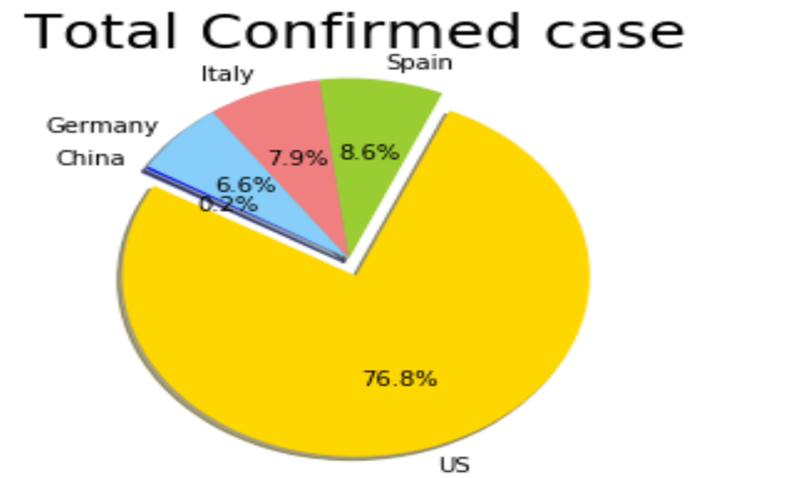

### Topic:Covid-19-Project

## Table of Contents
* [Introduction](#introduction)
* [Technologies](#technologies)
* [Development Process](#development-process)
* [Data Sources](#data-sources)
* [Development](#development-team)

covid.jpg
[Introduction](#introduction)

 COVID-19 is a new disease, caused by a novel (or new) coronavirus that has not previously been seen in humans.
 Because it is a new virus, scientists are learning more each day. 
 Although most people who have COVID-19 have mild symptoms, COVID-19 can also cause severe illness and even death.
 Some groups, including older adults and people who have certain underlying medical conditions, are at increased risk of severe illness.

Story of its origin -
During November, 2019 - a severe viral infection was noticed in Wuhan, a city in Hubei provinces of China. On November 17th 2019, the first case this infection was reported. Doctor's initially took it lightly as if it was a normal fever/cold. But, when a wide range of patients reported similar symptoms, a doctor - Dr. Li Wenliang of Chinese Academy of Sciences (CAS) Lab, claimed that it was a type of severe acute respiratory syndrome, spreading through a new coronavirus transmission in the whole Hubei province, very rapidly. This news got exposed during the late December 2019. Unfortunatly, Dr. Li also died due to being affected by the same disease.

As per the sources, in 2003, the same lab found first deadly SARS Coronavirus, led to 813 casualties, all over the world, within two months!
Initially, it was named as "Wuhan Virus". But, as it started spreading rapidly from Hubei to the whole mainland of China, its name got replaced by term "China Virus".

Finally, on Feb. 11th 2020, the World Health Organization (WHO) gave the disease an official name: COVID-19.
WHO has also declared the COVID-19 as a pandemic.

Since the outbreak of COVID-19, over 2,940,000 people have been infected throughout the world and over 203,822 people have been killed.

* [Technologies](#technologies)
# Technologies
1. Python
2. Pandas
3. Matplotlib
4. Jupyter Notebook
5. HTML & CSS
6. Bootstrap
7. Javscript
8. Github

* [Development Process](#development-process  utilized an API from the Whale Museum, which contained data in geoJSON format as well as city information, pod information, and day of sighting. We scraped the API, pulled it into PostgreSQL, used Sqlalchemy to connect to the database, and rendered our own API and routes using Flask. From here, we were able to build our website and create visualizations using Leaflet and Plotly. Finally, we utilized Heroku to deploy our website through Github. The following images are a few of the visualzations we created for our website:
1. 
This bar chart shows that J Pod is usually spotted within their own pod, whereas K and L are usually spotted with other pods.
2. 
Pie chart shows the percentages of times the J Pod is found alone versus with other pods. The website contains a dropdown menu to navigate between each pod. 
3. 
This interactive map shows the many orca sightings within our dataset as well as 3 of the other 5 marine mammals sighted.
3. 
This chart shows Friday Harbor is by far the location with the most sightings compared to the rest of the locations. 

At first I took  Covid-19 data from this Url https://data.humdata.org/dataset/novel-coronavirus-2019-ncov-cases#, which contained the confirmed,recovery and deaths csv data of different countries.Then after I convert all the data into dataframe in list.And after that compare the confirmed,recovered and deaths cases of five most affected countries US, Italy, Spain , Germany and China and the different visualzations we created.Finally, I utilized the website through GitHub to Visualise it.

1. 
This bar chart shows that J Pod is usually spotted within their own pod, whereas K and L are usually spotted with other pods.
2. 
Pie chart shows the percentages of times the J Pod is found alone versus with other pods. The website contains a dropdown menu to navigate between each pod. 
3. 
This interactive map shows the many orca sightings within our dataset as well as 3 of the other 5 marine mammals sighted.
3. 
This chart shows Friday Harbor is by far the location with the most sightings compared to the rest of the locations. 

[Data Sources](#data-sources)
Resources:-
      https://data.humdata.org/dataset/novel-coronavirus-2019-ncov-cases#

Data Range:- January 22th of Year 2020 to March first of Year 2021

[Development](#development-team)    

Developed by Bandana Deo:-https://www.linkedin.com/in/deobandana/

URL
 https://deobandana.github.io/Covid-19-Challenge/

## Questions: For Findings

1) Study of Confirmed Case ,Death Case and Recovered Case for most affected five countries. 
2) Comparing Confirmed Case for each five Countries and find Highest and lowest among them. 
3) Comparing Death Case for each five Countries and find Highest and lowest among them.
4) Comparing Recovered  Case for each five Countries and find Highest and lowest among them.
5) Find most affected and least affected among these five countries. 
